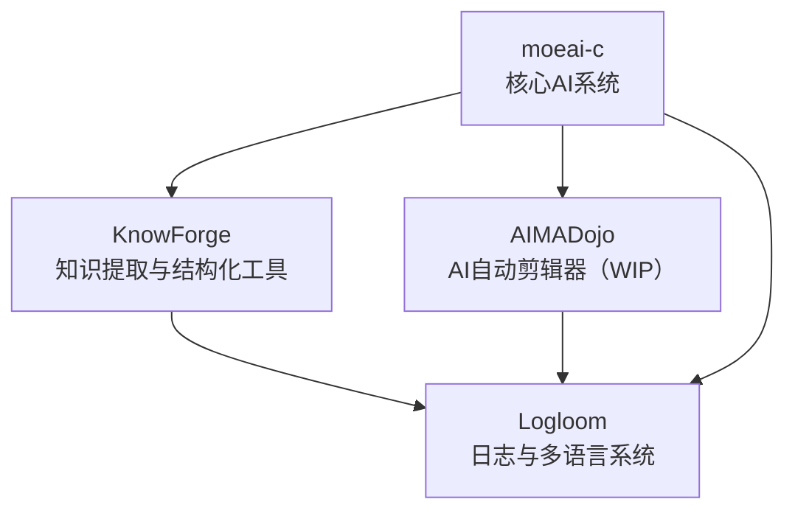

## 👋 Hi there / 嗨你好

Welcome to my structured project ecosystem. All my work is gradually converging toward a modular AI automation system for Linux — with `moeai-c` at the center.

---

## 🧠 Core Project / 核心项目

### `moeai-c` – AI Automation Core for Linux
> A system-level AI runtime deeply integrated with the Linux kernel. Serves as the orchestrator for my whole ecosystem.

- Kernel-level process scheduling optimization
- In-kernel AI inference (planned)
- Modular design with plugin architecture
- CLI-first philosophy, minimal external dependencies

🔗 [moeai-c (GitLab)](https://gitlab.dongzeyang.top/ydzat/moeai-c)

---

## 🧩 Ecosystem Overview / 项目生态结构图

---

## 📦 Modules / 模块说明

### [`Logloom`](https://github.com/ydzat/Logloom)
> A cross-language logging + multilingual interface layer
- Unified logging format across tools
- Designed for AI diagnostics, anomaly detection
- Supports Chinese/English/i18n message sets

### [`KnowForge`](https://github.com/ydzat/knowforge)
> AI-Powered Knowledge Refiner
- Convert PDFs, web, code into Markdown/Jupyter
- OCR + NLP + ChromaDB + LLM orchestration
- Tight integration with `moeai-c`

### [`AIMADojo`](https://github.com/ydzat/AIMADojo) *(WIP)*
> Automatic MAD (Music Video) Editor
- Beat sync + cut detection + AI previewing
- Designed to be invoked from `moeai-c`
- Focused on anime/game music content

### [`AntiCheatVM`](https://github.com/ydzat/AntiCheatVM)
> CLI tool for gaming VMs under Linux
- Custom Windows VM builder
- For games with anti-cheat (e.g., Wuthering Waves, R6, APEX)

---

## 📚 Currently Learning / 当前学习内容
- Advanced Machine Learning / 高级机器学习
- Linux Kernel Programming / Linux 内核编程
- Software Language Engineering / 软件语言工程
- Reinforcement Learning & Learning-based Control / 强化学习与基于学习的控制
- Concepts and Models for Parallel and Data-centric Programming / 并行与以数据为中心的编程模型

> I expect to start my Master's thesis next semester. / 预计下学期开始撰写硕士论文。

---

## 🤝 Contact & Collaboration / 联系与合作

- 👯 Looking to collaborate on: AI agents, DSL tooling, OS-level automation
- 💼 Open to work in: AI, Game Development, VR, Parallel Programming, Systems Engineering
- 💬 Ask me about: Python automation, RL experiments, Linux dev, CS in Germany
- 📫 Email: [ydzat@live.com](mailto:ydzat@live.com)
- 😄 Pronouns: he/him / 他
- ⚡ Fun fact: I once wrote a bot to snipe appointments from the German Ausländerbehörde... but they’re always on vacation. 😅
