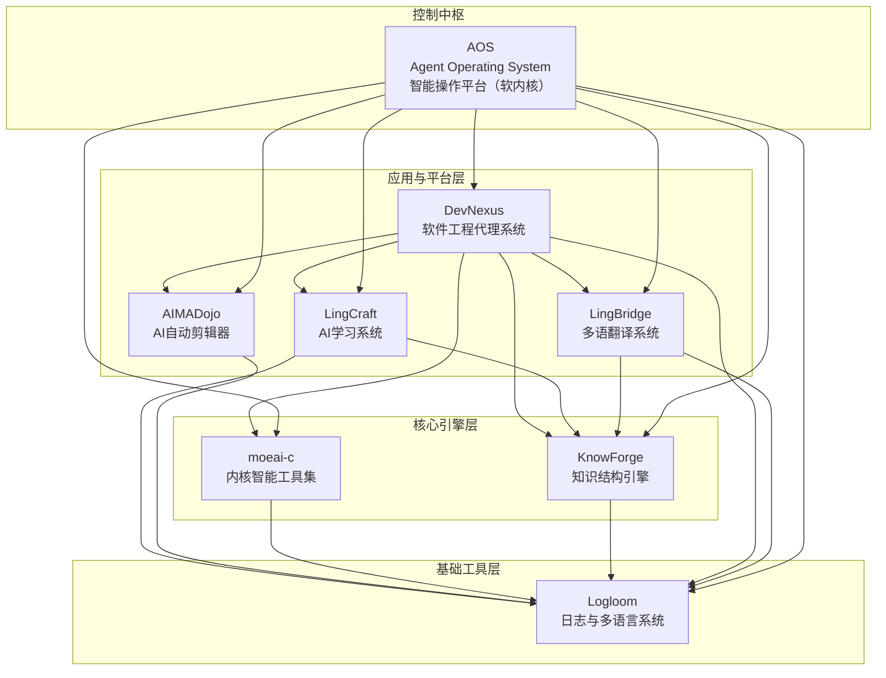

## 👋 Hi there / 嗬你好

Welcome to my structured project ecosystem. All my work is gradually converging toward a modular, task-driven **Agent Operating System (AOS)** — a platform built for AI automation and software construction.

欢迎来到我的项目生态系统。目前我的所有工作正逐步汇聚为一个模块化、任务驱动的 **智能代理操作系统 AOS（智核）**，它致力于 AI 自动化与软件构建。

---

## 🧠 Platform Core / 系统平台核心

### [`AOS`](https://github.com/ydzat/AgentOS) – Agent Operating System / 智核 *(Core Platform)*

> A soft-kernel platform that unifies all my projects under a task-driven, multi-agent runtime.

> 一个软内核平台，以任务驱动和智能代理为核心，统一调度我所有的子项目。

AOS is the architectural foundation of my ecosystem. It is a soft-layer operating system for intelligent agent coordination, creation workflows, and system-wide orchestration — akin to what ROS is for robots, AOS is for AI-driven software and creative agents.

AOS 是我整个项目体系的架构核心，它提供智能代理的统一运行环境，调度任务与模块，形成面向意图的执行系统。就像 ROS 之于机器人，AOS 是创作型智能体的操作系统。

**Core Responsibilities / 核心职责：**

- Task management / 任务管理
- Agent lifecycle orchestration / Agent 生命周期调度
- Dependency-aware multi-module execution / 多模块依赖感知调度
- Execution feedback learning / 自我演化与行为修复机制

---

## 🧐 Core Projects / 核心项目

### `moeai-c` – Kernel-Side Agent Toolkit for Linux Automation / Linux 内核智能工具集

> A system-level toolkit designed to extend AOS capabilities into the Linux kernel space.

> 一个用于扩展 AOS 到 Linux 内核侧的系统级智能工具包。

moeai-c is not the core engine but a specialized AgentPack under AOS. It focuses on OS-side automation, low-level task monitoring, and runtime feedback capture.

moeai-c 不再被视为“核心 AI 引擎”，而是 AOS 下的一个特殊 AgentPack，专注于操作系统自动化、内核交互与实时反馈。

* Kernel-level process scheduling augmentation / 进程调度增强
* Hooks for eBPF-based awareness (planned) / eBPF 感知（计划中）
* CLI tools for Linux automation / 命令行工具
* Seamless integration with AOS / 无缝接入 AOS 系统

### `DevNexus` – Intelligent Agent System for Software Automation / 智能软件工程系统 *(硕士论文核心)*

> An agent-based coordination platform for collaborative software engineering.

> 基于 Agent 的智能化软件构建系统，我硕士论文的核心平台。

### [`DevNexusLite`](https://gitlab.dongzeyang.top/ydzat/devnexuslite) – Lightweight Distributed Agent System / 轻量级分布式代理系统 *(工程原型)*

> A GitLab-driven, modular, resource-efficient multi-agent system designed for practical collaboration under limited compute environments.

> 基于 GitLab 的模块化 Agent 协作系统，适用于资源有限环境的实际测试。

DevNexusLite operates as an **AgentPack** within AOS. It simulates multi-agent orchestration using Git, Python, and minimal config.

DevNexusLite 在 AOS 中作为一个 AgentPack 运行，使用 Git + Python 模拟多代理协作。

---

## 🧹 Ecosystem Overview / 项目生态结构图

---

## 📦 Modules / 模块说明

### [`Logloom`](https://github.com/ydzat/Logloom)

> A cross-language logging + multilingual interface layer

* Unified logging format across tools
* Designed for AI diagnostics, anomaly detection
* Supports Chinese/English/i18n message sets
* **Version 1.0 released**

### [`KnowForge`](https://github.com/ydzat/knowforge)

> AI-Powered Knowledge Refiner

* Convert PDFs, web, code into Markdown/Jupyter
* OCR + NLP + ChromaDB + LLM orchestration
* Integrated with `moeai-c`, used in `DevNexus` experiments
* **Actively under development**

### `LingCraft` *(WIP)*

> Structured AI Learning System for Students & Language Learners

* Cross-platform intelligent notebook + adaptive learning engine
* Multimodal input: handwriting, screenshots, voice, structured text
* Built-in review scheduler and card-based practice flow
* Fully developed via `DevNexusLite` agents (GitLab-driven)
* Powered by `KnowForge` for OCR, semantic structuring, and concept mapping
* Notebook execution engine with Python + Pyodide
* **Currently in early development**

### 🔊 LingBridge · 言桥 *(WIP)*

> **Bridging voices, beyond words.**
> **连接声音，跨越语言。**

**LingBridge** 是一个多平台智能翻译系统，聚焦于多语种语音/文字实时翻译、个体感知与上下文理解，旨在打破语言壁垒，构建沉浸式、自然流畅的沟通体验。未来将拓展至 VR、AR 与脑机接口等人机交互形态。

**LingBridge** is a cross-platform intelligent translation system designed for immersive, seamless multilingual communication. With real-time translation, contextual understanding, and speaker awareness, it bridges language gaps across physical and virtual worlds—including future integration with VR, AR, and neural interfaces.

### [`AIMADojo`](https://github.com/ydzat/AIMADojo) *(WIP)*

> Automatic MAD (Music Video) Editor

* Beat sync + cut detection + AI previewing
* Designed to be invoked from `moeai-c`
* Focused on anime/game music content
* **Still in planning stage**

### [`AntiCheatVM`](https://github.com/ydzat/AntiCheatVM)

> CLI tool for gaming VMs under Linux

* Custom Windows VM builder
* For games with anti-cheat (e.g., Wuthering Waves, R6, APEX)
* **Core scripts implemented, but outcome didn't meet expectations**

---

## 📚 Currently Learning / 当前学习内容

* Advanced Machine Learning / 高级机器学习
* Linux Kernel Programming / Linux 内核编程
* Software Language Engineering / 软件语言工程
* Reinforcement Learning & Learning-based Control / 强化学习与基于学习的控制
* Concepts and Models for Parallel and Data-centric Programming / 并行与以数据为中心的编程模型

> I expect to start my Master's thesis next semester. / 预计下季开始撰写硕士论文。

---

## 🤝 Contact & Collaboration / 联系与合作

* 👯 Looking to collaborate on: AI agents, DSL tooling, OS-level automation
* 💼 Open to work in: AI, Game Development, VR, Parallel Programming, Systems Engineering
* 💬 Ask me about: Python automation, RL experiments, Linux dev, CS in Germany
* 📧 Email: [ydzat@live.com](mailto:ydzat@live.com)
* 😄 Pronouns: he/him / 他
* ⚡ Fun fact: I once wrote a bot to snipe appointments from the German Ausländerbehörde... but they’re always on vacation. 😅

---

## 🎮 Side Projects & Game Dev / 副项目与游戏开发

I'm passionate about games and aspire to work in the game industry in the future. I am currently prototyping a "fourth wall-breaking" narrative-driven game. Whether it will be released on Steam depends on the final development quality.

此外，我有多个关于交互叙事与玩法机制的游戏创意，目前尚待时间与资源支持。
