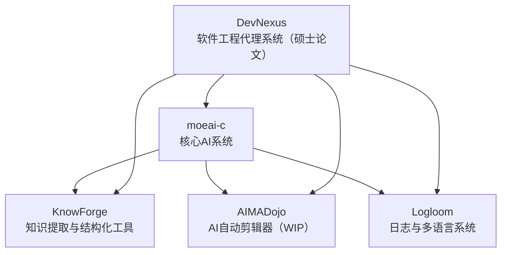

## 👋 Hi there / 嗬你好

Welcome to my structured project ecosystem. All my work is gradually converging toward a modular AI automation system for Linux and software engineering — with `moeai-c` and `DevNexus` at the center.

---

## 🧐 Core Projects / 核心项目

### `moeai-c` – AI Automation Core for Linux

> A system-level AI runtime deeply integrated with the Linux kernel. Serves as the orchestrator for OS-side automation.

* Kernel-level process scheduling optimization
* In-kernel AI inference (planned)
* Modular design with plugin architecture
* CLI-first philosophy, minimal external dependencies

🔗 [moeai-c (GitLab)](https://gitlab.dongzeyang.top/ydzat/moeai-c)

### `DevNexus` – Intelligent Agent System for Software Automation *(in thesis development)*

> An agent-based coordination platform for collaborative software engineering.

This system forms the core of my master's thesis (tentative title: *"DevNexus: A Hierarchical Multi-Agent System for Intelligent Software Construction"*), aiming for goal-consistent, self-evolving automation in software projects.

---

## 🧹 Ecosystem Overview / 项目生态结构图

---

## 📦 Modules / 模块说明

### [`Logloom`](https://github.com/ydzat/Logloom)

> A cross-language logging + multilingual interface layer

* Unified logging format across tools
* Designed for AI diagnostics, anomaly detection
* Supports Chinese/English/i18n message sets
* **Version 1.0 released**

### [`KnowForge`](https://github.com/ydzat/knowforge)

> AI-Powered Knowledge Refiner

* Convert PDFs, web, code into Markdown/Jupyter
* OCR + NLP + ChromaDB + LLM orchestration
* Integrated with `moeai-c`, used in `DevNexus` experiments
* **Actively under development**

### [`AIMADojo`](https://github.com/ydzat/AIMADojo) *(WIP)*

> Automatic MAD (Music Video) Editor

* Beat sync + cut detection + AI previewing
* Designed to be invoked from `moeai-c`
* Focused on anime/game music content
* **Still in planning stage**

### [`AntiCheatVM`](https://github.com/ydzat/AntiCheatVM)

> CLI tool for gaming VMs under Linux

* Custom Windows VM builder
* For games with anti-cheat (e.g., Wuthering Waves, R6, APEX)
* **Core scripts implemented, but outcome didn't meet expectations**

---

## 📚 Currently Learning / 当前学习内容

* Advanced Machine Learning / 高级机器学习
* Linux Kernel Programming / Linux 内核编程
* Software Language Engineering / 软件语言工程
* Reinforcement Learning & Learning-based Control / 强化学习与基于学习的控制
* Concepts and Models for Parallel and Data-centric Programming / 并行与以数据为中心的编程模型

> I expect to start my Master's thesis next semester. / 预计下季开始撰写硕士论文。

---

## 🤝 Contact & Collaboration / 联系与合作

* 👯 Looking to collaborate on: AI agents, DSL tooling, OS-level automation
* 💼 Open to work in: AI, Game Development, VR, Parallel Programming, Systems Engineering
* 💬 Ask me about: Python automation, RL experiments, Linux dev, CS in Germany
* 📧 Email: [ydzat@live.com](mailto:ydzat@live.com)
* 😄 Pronouns: he/him / 他
* ⚡ Fun fact: I once wrote a bot to snipe appointments from the German Ausländerbehörde... but they’re always on vacation. 😅

---

## 🎮 Side Projects & Game Dev / 副项目与游戏开发

I'm passionate about games and aspire to work in the game industry in the future. I am currently prototyping a "fourth wall-breaking" narrative-driven game. Whether it will be released on Steam depends on the final development quality.

In addition, I have a "game idea backlog" filled with concepts that require significantly more resources and technical sophistication. These will be developed only when the right team and support become available.
