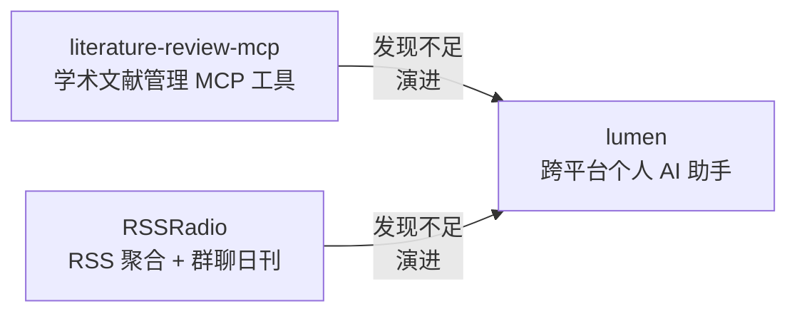
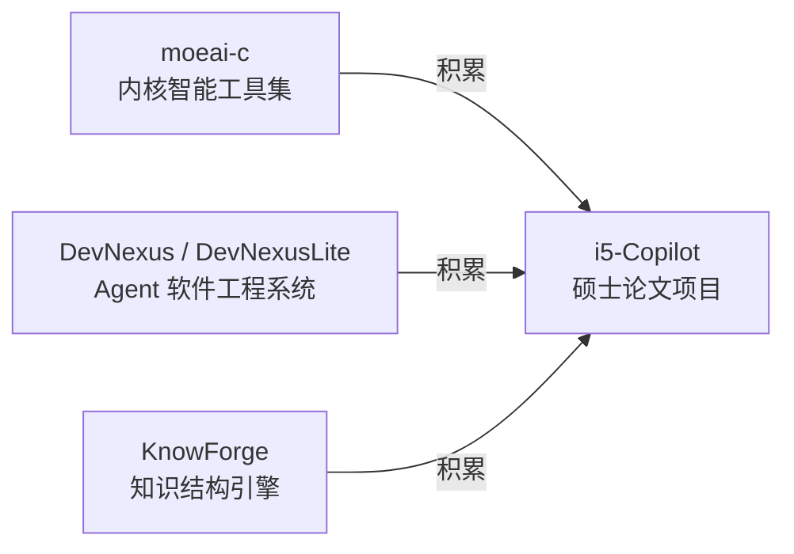

## 👋 Hi there / 嗬你好

Master's student graduating soon, currently focused on my thesis and work projects. Interested in AI Agents, systems programming, and building tools that solve real problems.

即将毕业的硕士生，目前专注于论文和工作项目。对 AI Agent、系统编程和实用工具开发感兴趣。

> 入驻了爱发电：[我的主页](https://afdian.com/a/ydzat)

---

## 🔭 Current Focus / 当前重点

### 🎓 Thesis: i5-Copilot *(Private)*

> Agentic AI empowered Research Institutional Management System

> 基于 Agentic AI 的科研机构管理系统

My Master's thesis project — an AI-driven system for institutional research management. Built on top of earlier work from DevNexus/DevNexusLite.

硕士论文项目，基于早期 DevNexus/DevNexusLite 项目的积累。

### 💼 YueWei *(Private, YJ-Devs)*

> Company project / 公司项目

---

## 🚀 Featured Projects / 展示项目

### AI Assistant & Knowledge Tools / AI 助手与知识工具

```mermaid
graph LR
  A[literature-review-mcp<br/>学术文献管理 MCP 工具] -->|发现不足<br/>演进| C[lumen<br/>跨平台个人 AI 助手]
  B[RSSRadio<br/>RSS 聚合 + 群聊日刊] -->|发现不足<br/>演进| C
```

#### [`lumen`](https://github.com/ydzat/lumen)

> Cross-platform personal AI assistant for research & companionship

> 跨平台个人 AI 助手：科研辅助与情感陪伴

The evolution of `literature-review-mcp` and `RSSRadio` — a more complete, unified AI assistant that addresses the limitations discovered in both earlier projects. Kotlin/Compose Multiplatform.

在 `literature-review-mcp` 和 `RSSRadio` 的开发过程中发现了各自的不足，由此演进为更完整的统一 AI 助手。

#### [`literature-review-mcp`](https://github.com/ydzat/literature-review-mcp)

> Academic paper management & analysis MCP tool for graduate-level literature reviews

> 面向研究生论文级别文献综述的学术论文管理与分析工具

Multi-source academic search, intelligent quality assessment, smart compression, multi-LLM provider support, Notion integration. TypeScript.

#### [`RSSRadio`](https://github.com/ydzat/RSSRadio)

> LangBot plugin: RSS aggregation + group chat daily digest with virtual anchor persona

> LangBot 插件：RSS 订阅聚合 + 群聊日刊生成，支持虚拟主播人格

Fetches from multiple RSS sources via RSSHub mirrors, generates LLM-powered summaries for QQ groups. Python.

### Thesis Lineage / 论文项目脉络

```mermaid
graph LR
  D[moeai-c<br/>内核智能工具集] -->|积累| F[i5-Copilot<br/>硕士论文项目]
  E[DevNexus / DevNexusLite<br/>Agent 软件工程系统] -->|积累| F
  G[KnowForge<br/>知识结构引擎] -->|积累| F
```

*These predecessor projects (`moeai-c`, `DevNexus`, `DevNexusLite`, `KnowForge`) are now archived — their contributions live on in the thesis.*

*前驱项目已归档，其成果已融入论文。*

### Side Projects / 独立项目

#### [`OracleLang`](https://github.com/ydzat/OracleLang)

> Divination using the I Ching / 使用《易经》进行算卦

A fun side project that turned out to be surprisingly popular. Python.

#### [`botplayer`](https://github.com/ydzat/botplayer)

> Play your own music list (WebDAV) with a Discord bot

> 用 Discord 机器人播放你自己的音乐列表（WebDAV）

#### [`AntiCheatVM`](https://github.com/ydzat/AntiCheatVM)

> CLI tool for building gaming Windows VMs on Linux

> Linux 下搭建游戏虚拟机的命令行工具

---

## 🧠 Vision: AOS / 愿景项目

### [`AgentOS`](https://github.com/ydzat/AgentOS) – Agent Operating System / 智核

> Agent as Process. Inference as Computation. Memory as Filesystem.

> Agent 即进程，推理即计算，记忆即文件系统。

A standalone microkernel OS built in Rust, with AI Agent as its first-class kernel primitive. Not middleware on existing OSes — a new category of operating system designed for autonomous Agent execution.

一个用 Rust 从零构建的独立微内核操作系统，以 AI Agent 为内核一等公民。不是现有 OS 上的中间件，而是为 Agent 自主运行设计的全新品类操作系统。

```mermaid
graph TD
  subgraph AOS Microkernel
    K1[Agent Lifecycle]
    K2[IPC]
    K3[Capability Control]
    K4[Resource Budget]
  end

  subgraph Userspace Services
    U1[Inference Engine]
    U2[Memory Filesystem]
    U3[Device Drivers]
    U4[AgentPack Modules]
  end

  subgraph Agents
    A1[PersonalAgent]
    A2[Application Agents]
    A3[Tool Agents]
    A4[Safety Agent]
  end

  Agents --> Userspace Services
  Userspace Services --> AOS Microkernel
```

*Currently in conceptual design phase. / 目前处于概念设计阶段。*

---

## 📦 Archived Projects / 归档项目

The following projects have served their purpose. They are no longer actively maintained:

以下项目已完成其历史使命，不再活跃维护：

`moeai-c` · `DevNexus` · `DevNexusLite` · `KnowForge` · `Logloom` · `LingCraft` · `LingBridge` · `AIMADojo`

---

## 🤝 Contact / 联系方式

* 👯 Looking to collaborate on: AI Agents, systems programming, OS-level innovation
* 💼 Open to work in: AI, Game Development, VR, Systems Engineering
* 📧 Email: [ydzat@live.com](mailto:ydzat@live.com)
* ⚡ Fun fact: I once wrote a bot to snipe appointments from the German Ausländerbehörde... but they're always on vacation.
