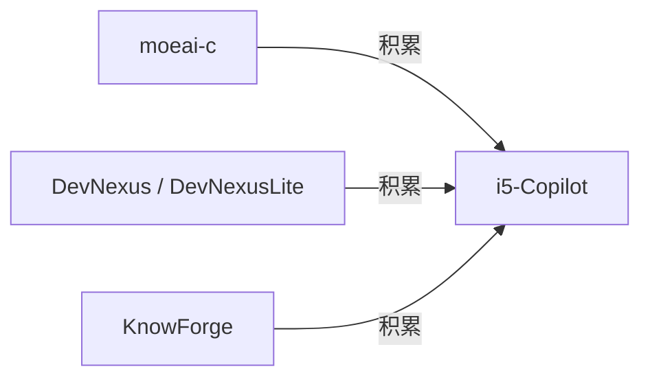
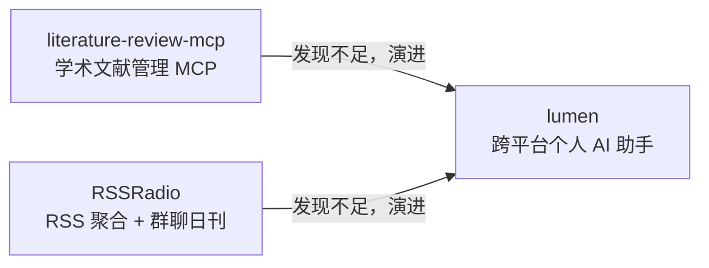

## 👋 Hi there / 嗬你好

Master's student graduating soon, currently focused on my thesis and work projects. Interested in AI Agents, systems programming, and building tools that solve real problems.

即将毕业的硕士生，目前专注于论文和工作项目。对 AI Agent、系统编程和实用工具开发感兴趣。

---

## 🔭 Current Focus / 当前重点

### 🎓 Thesis: i5-Copilot *(Private)*

> Agentic AI empowered Research Institutional Management System

> 基于 Agentic AI 的科研机构管理系统

My Master's thesis project — an AI-driven system for institutional research management. Built on top of earlier work from DevNexus/DevNexusLite/KnowForge.

硕士论文项目，基于早期 DevNexus/DevNexusLite/KnowForge 项目的积累。

```mermaid
graph LR
  D[moeai-c] -->|积累| F[i5-Copilot]
  E[DevNexus / DevNexusLite] -->|积累| F
  G[KnowForge] -->|积累| F
```

### 💼 YueWei *(Private, YJ-Devs)*

> Company project / 公司项目

---

## 🚀 Active Projects / 活跃项目

### AI Assistant & Knowledge Tools / AI 助手与知识工具

```mermaid
graph LR
  A[literature-review-mcp<br/>学术文献管理 MCP] -->|发现不足，演进| C[lumen<br/>跨平台个人 AI 助手]
  B[RSSRadio<br/>RSS 聚合 + 群聊日刊] -->|发现不足，演进| C
```

#### [`lumen`](https://github.com/ydzat/lumen)

> Cross-platform personal AI assistant for research & companionship

> 跨平台个人 AI 助手：科研辅助与情感陪伴

The evolution of `literature-review-mcp` and `RSSRadio` — a more complete, unified AI assistant that addresses the limitations discovered in both earlier projects. Kotlin/Compose Multiplatform. *v0.1.0-alpha*

#### [`RSSRadio`](https://github.com/ydzat/RSSRadio)

> LangBot plugin: RSS aggregation + group chat daily digest with virtual anchor persona

> LangBot 插件：RSS 订阅聚合 + 群聊日刊生成，支持虚拟主播人格

18 built-in RSS sources, parallel mirror racing, LLM-powered summaries for QQ groups. Python. *v1.1.0*

#### [`literature-review-mcp`](https://github.com/ydzat/literature-review-mcp) 🔨 *Reconstructing*

> Academic paper management & analysis MCP tool for graduate-level literature reviews

> 面向研究生论文级别文献综述的学术论文管理与分析工具

Multi-source academic search, intelligent quality assessment, smart compression, multi-LLM provider support, Notion integration. TypeScript. Published on npm. Currently under reconstruction.

### LangBot Plugins / LangBot 插件

#### [`OracleLang`](https://github.com/ydzat/OracleLang)

> Divination using the I Ching (Liu Yao) / 使用《易经》六爻算卦

LangBot plugin. A fun side project that turned out to be surprisingly popular. Python. *v3.1.0*

#### [`botplayer`](https://github.com/ydzat/botplayer) ⏸️ *Pending refactor*

> Play your own music list (WebDAV) with a Discord bot

> 用 Discord 机器人播放你自己的音乐列表（WebDAV）

LangBot plugin. Functional, but pending refactor due to LangBot's own restructuring. Python.

---

## 🧠 Vision / 愿景项目

### [`AgentOS`](https://github.com/ydzat/AgentOS) – Agent Operating System / 智核

> Agent as Process. Inference as Computation. Memory as Filesystem.

> Agent 即进程，推理即计算，记忆即文件系统。

A standalone microkernel OS built in Rust, with AI Agent as its first-class kernel primitive. Not middleware on existing OSes — a new category of operating system designed for autonomous Agent execution.

一个用 Rust 从零构建的独立微内核操作系统，以 AI Agent 为内核一等公民。不是现有 OS 上的中间件，而是为 Agent 自主运行设计的全新品类操作系统。

*Currently in conceptual design phase. / 目前处于概念设计阶段。*

---

## 📋 Planned / 规划中

The following projects are planned but not yet implemented:

以下项目在计划中，尚未实现：

| Project | Description |
|---------|-------------|
| **AIMADojo** | AI-driven automated MAD (Music Anime Douga) video creation pipeline / AI 自动 MAD 视频创作 |
| **LingCraft** | Structured AI learning system for students & language learners / AI 结构化学习系统 |
| **LingBridge** | Cross-platform intelligent multilingual translation system / 跨平台智能多语翻译系统 |

---

## 🎮 Game Dev / 游戏开发

### [`GreenHorror`](https://github.com/ydzat/GreenHorror)

> A VR horror game paying homage to Hideo Kojima's P.T. / 致敬 P.T. 的 VR 恐怖游戏

Supports Quest 2/3 and Vive. Has a playable release. Development concluded.

支持 Quest 2/3 和 Vive，已有可玩版本，开发已结束。

---

## 📦 Archived / 归档项目

The following projects have served their purpose and are no longer actively maintained:

以下项目已完成其历史使命，不再活跃维护：

`moeai-c` · `DevNexus` · `DevNexusLite` · `KnowForge` · `Logloom` · `AntiCheatVM`

---

## 🤝 Contact / 联系方式

* 👯 Looking to collaborate on: AI Agents, systems programming, OS-level innovation
* 💼 Open to work in: AI, Game Development, VR, Systems Engineering
* 📧 Email: [ydzat@live.com](mailto:ydzat@live.com)
* ⚡ Fun fact: I once wrote a bot to snipe appointments from the German Ausländerbehörde... but they're always on vacation.
