## 👋 Hi there / 嗬你好

Welcome to my structured project ecosystem. All my work is gradually converging toward a modular AI automation system for Linux and software engineering — with `moeai-c` and `DevNexus` at the center.

---

## 🧐 Core Projects / 核心项目

### `moeai-c` – AI Automation Core for Linux

> A system-level AI runtime deeply integrated with the Linux kernel. Serves as the orchestrator for OS-side automation.

* Kernel-level process scheduling optimization
* In-kernel AI inference (planned)
* Modular design with plugin architecture
* CLI-first philosophy, minimal external dependencies

🔗 [moeai-c (GitLab)](https://gitlab.dongzeyang.top/ydzat/moeai-c)

### `DevNexus` – Intelligent Agent System for Software Automation *(in thesis development)*

> An agent-based coordination platform for collaborative software engineering.

This system forms the core of my master's thesis (tentative title: *"DevNexus: A Hierarchical Multi-Agent System for Intelligent Software Construction"*), aiming for goal-consistent, self-evolving automation in software projects.

### [`DevNexusLite`](https://gitlab.dongzeyang.top/ydzat/devnexuslite) – Lightweight Distributed Agent System *(engineering prototype)*

> A GitLab-driven, modular, resource-efficient multi-agent system designed for practical collaboration under limited compute environments.

**DevNexusLite** is a stripped-down yet functional variant of the original DevNexus concept. It replaces the hierarchical transformer-style agent infrastructure with a Git-centric coordination mechanism, allowing distributed LLM-based agents to operate across different machines (Windows, Linux laptops, cloud VMs) with minimal setup.

This system was created as a pragmatic response to infrastructure constraints during the early development of DevNexus. It enables real-world testing of agent interactions and modular task execution through a simple Git + Python + `.env` configuration model. Tasks are submitted via GitLab commits or issues, then picked up and executed by decentralized agents using DeepSeek APIs, Copilot, or Claude (via VSCode).

While DevNexus is positioned as the theoretical foundation of my thesis (*"A Hierarchical Multi-Agent System for Intelligent Software Construction"*), **DevNexusLite serves as the hands-on, field-tested implementation layer**, helping me validate architectural ideas in production-like conditions.

**Key Features:**

* Fully GitLab-driven: task submission, result merging, version control
* Decentralized execution: agents run on arbitrary devices with dynamic participation
* Plug-and-play agent setup via `.env` + Python scripts
* Supports DeepSeek API, Git automation, LLM prompt templating
* Designed to simulate multi-agent coordination with only one or few real LLM endpoints
* Architecture is easy to extend, yet suitable for single-user workflows

**Use Cases:**

* Experimenting with collaborative LLM agents on a budget
* Testing modular software generation pipelines
* Validating prompt orchestration and Git-based coordination strategies

📁 Repo: [`devnexuslite`](https://gitlab.dongzeyang.top/ydzat/devnexuslite)

---

### 🦩 How DevNexusLite relates to DevNexus

| Aspect         | DevNexus                                                               | DevNexusLite                                                 |
| -------------- | ---------------------------------------------------------------------- | ------------------------------------------------------------ |
| Purpose        | Theoretical multi-agent software construction system (research-driven) | Practical, lightweight implementation of agent collaboration |
| Infrastructure | LangGraph / Transformer-style agent orchestration (planned)            | GitLab + CLI agents + LLM APIs                               |
| Architecture   | Hierarchical, goal-consistent multi-agent planning                     | Flat, task-driven, file-based coordination                   |
| Role           | Thesis core platform                                                   | Engineering playground & testing ground                      |
| Status         | In design, thesis-oriented                                             | Actively prototyped and iterated                             |

---

## 🧹 Ecosystem Overview / 项目生态结构图

```mermaid
graph TD
  A[moeai-c<br>核心AI系统] --> B[KnowForge<br>知识提取与结构化工具]
  A --> C[AIMADojo<br>AI自动剪辑器（WIP）]
  A --> E[Logloom<br>日志与多语言系统]

  D[DevNexus<br>软件工程代理系统（硕士论文）] --> A
  D --> B
  D --> C
  D --> E
```

---

## 📦 Modules / 模块说明

### [`Logloom`](https://github.com/ydzat/Logloom)

> A cross-language logging + multilingual interface layer

* Unified logging format across tools
* Designed for AI diagnostics, anomaly detection
* Supports Chinese/English/i18n message sets
* **Version 1.0 released**

### [`KnowForge`](https://github.com/ydzat/knowforge)

> AI-Powered Knowledge Refiner

* Convert PDFs, web, code into Markdown/Jupyter
* OCR + NLP + ChromaDB + LLM orchestration
* Integrated with `moeai-c`, used in `DevNexus` experiments
* **Actively under development**

### `LingCraft` *(WIP)*

> Structured AI Learning System for Students & Language Learners

* Cross-platform intelligent notebook + adaptive learning engine
* Multimodal input: handwriting, screenshots, voice, structured text
* Built-in review scheduler and card-based practice flow
* Fully developed via `DevNexusLite` agents (GitLab-driven)
* Powered by `KnowForge` for OCR, semantic structuring, and concept mapping
* Notebook execution engine with Python + Pyodide
* **Currently in early development**

### [`AIMADojo`](https://github.com/ydzat/AIMADojo) *(WIP)*

> Automatic MAD (Music Video) Editor

* Beat sync + cut detection + AI previewing
* Designed to be invoked from `moeai-c`
* Focused on anime/game music content
* **Still in planning stage**

### [`AntiCheatVM`](https://github.com/ydzat/AntiCheatVM)

> CLI tool for gaming VMs under Linux

* Custom Windows VM builder
* For games with anti-cheat (e.g., Wuthering Waves, R6, APEX)
* **Core scripts implemented, but outcome didn't meet expectations**

---

## 📚 Currently Learning / 当前学习内容

* Advanced Machine Learning / 高级机器学习
* Linux Kernel Programming / Linux 内核编程
* Software Language Engineering / 软件语言工程
* Reinforcement Learning & Learning-based Control / 强化学习与基于学习的控制
* Concepts and Models for Parallel and Data-centric Programming / 并行与以数据为中心的编程模型

> I expect to start my Master's thesis next semester. / 预计下季开始撰写硕士论文。

---

## 🤝 Contact & Collaboration / 联系与合作

* 👯 Looking to collaborate on: AI agents, DSL tooling, OS-level automation
* 💼 Open to work in: AI, Game Development, VR, Parallel Programming, Systems Engineering
* 💬 Ask me about: Python automation, RL experiments, Linux dev, CS in Germany
* 📧 Email: [ydzat@live.com](mailto:ydzat@live.com)
* 😄 Pronouns: he/him / 他
* ⚡ Fun fact: I once wrote a bot to snipe appointments from the German Ausländerbehörde... but they’re always on vacation. 😅

---

## 🎮 Side Projects & Game Dev / 副项目与游戏开发

I'm passionate about games and aspire to work in the game industry in the future. I am currently prototyping a "fourth wall-breaking" narrative-driven game. Whether it will be released on Steam depends on the final development quality.

In addition, I have a "game idea backlog" filled with concepts that require significantly more resources and technical sophistication. These will be developed only when the right team and support become available.
